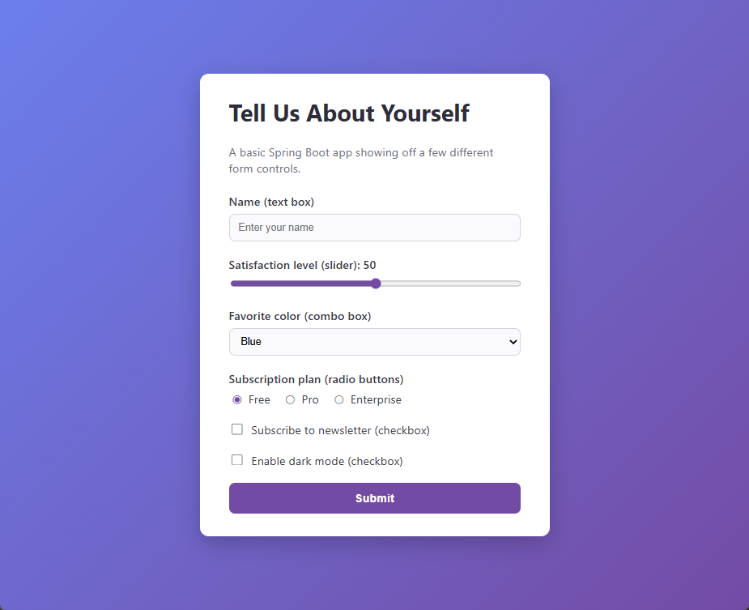

# simple-spring-boot-web-app

A basic Spring Boot web application demonstrating a variety of HTML form controls
(text box, slider, combo box, radio buttons, checkboxes) using Thymeleaf.

## Requirements

- Java 21
- Maven 3.9+

## Tech Stack

| Technology | Purpose |
| --- | --- |
| Java 21 | Backend language |
| Spring Boot 4.1.1 | Application configuration and executable JAR packaging |
| Spring Web MVC | Controllers and request handling, via `spring-boot-starter-web` |
| Embedded Apache Tomcat | HTTP server |
| Thymeleaf | Server-rendered HTML templates, via `spring-boot-starter-thymeleaf` |
| Jakarta Bean Validation | Server-side form validation, via `spring-boot-starter-validation` |
| HTML and CSS | Form controls and page styling |
| Maven | Dependency management and builds |

## Running the app

```bash
mvn spring-boot:run
```

Then open [http://localhost:8080](http://localhost:8080) in your browser.

By default the app listens on port `8080` (configurable via
`server.port` in [`src/main/resources/application.properties`](src/main/resources/application.properties)).

## Screenshot



## Building a jar

```bash
mvn package
java -jar target/simple-spring-boot-web-app-0.0.1-SNAPSHOT.jar
```

## What it does

The home page (`/`) renders a form bound to a `PreferencesForm` model with:

- A text box for your name (required, validated with Bean Validation)
- A range slider for a satisfaction score (0-100), with the current value
  updated live as you drag it
- A combo box (`<select>`) to pick a favorite color
- A set of radio buttons to pick a subscription plan
- Two checkboxes (newsletter opt-in, dark mode)

Submitting the form (`POST /submit`) validates the input and renders a
summary page showing the values you selected.

## Project structure

```
src/main/java/com/example/demo/
├── DemoApplication.java              # Spring Boot entry point
├── controller/
│   └── PreferencesController.java    # GET / and POST /submit handlers
└── model/
    └── PreferencesForm.java          # Form-backing bean

src/main/resources/
├── application.properties
├── static/css/style.css
└── templates/
    ├── index.html                    # Form page
    └── result.html                   # Submission summary page
```
